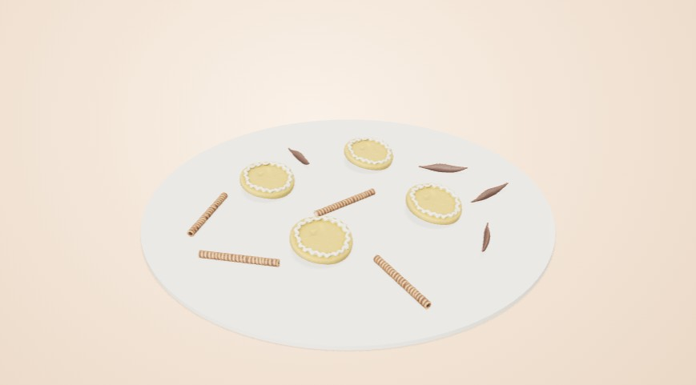

# Повторная проверка сборок

Исправления проверялись на снимках настоящего WebGL-конструктора, включая противоположные ракурсы. `gallery.html` содержит точные состояния проверенных сочетаний и открывает их в конструкторе. Полные результаты находятся в `results-*.json`, геометрические проверки — в `assembly-checks.json`, проверки изображений — в `image-checks.json`.

## Кондитерская

- Вместо общего масштаба украшений заданы размеры в сантиметрах и измерены проекции каждого ассета: голубика 1,05 см, клубника 3,8 см, малина 1,9 см, макарон 4,2 см. Узкая вафельная трубочка сохраняет длину 7,5 см и диаметр 0,7 см.
- Ярусы действительно расположены один над другим. Нижние полки резервируют место под следующий ярус. Кремовый бордюр шестигранного торта следует границе исходной геометрии.
- На тарелке есть отдельный кусок с четырьмя вариантами начинки и слоями бисквита. Размер тарелки мини-десертов зависит от геометрии изделий и количества.
- Шесть эклеров стоят в двух рядах, исходные шоколад и тесто сохраняют карты материалов. Ягоды распределяются между изделиями; крупный декор получает место на тарелке.
- При просмотре капкейков обнаружился зазор под ягодами. Карты высоты пересчитаны по отображаемой текстурированной геометрии с разрешением 81×81. Посадка проверяет нижние вершины украшения; отверстие пончика и отсутствующая опора исключаются.
- Широкий двухножечный баннер для мини-десерта располагается на тарелке. Покрытия, рассчитанные на круглый торт, исключаются из несовместимых сохранённых составов. Кнопка увеличения количества учитывает свободное место. После удаления несовместимого или не помещающегося декора состав пересчитывается до устойчивого состояния; повторное открытие не меняет количество или цену.

Проверочные крупные снимки: [крем и ягоды](physical/cupcake-cream-front.jpg), [пончик сверху](physical/donut-hole-top.jpg), [шесть эклеров](physical/eclair-six-front.jpg), [три шестигранных яруса](physical/hex-three-front.jpg).

### Длинный декор на тарелке

На сочетании печенья с трубочками визуальная проверка обнаружила вертикальные вставки прямо в тарелку. Трубочки и шоколадные пластинки теперь лежат на тарелке и плоской выпечке; на кремовых капкейках и брауни доступны вертикальные вставки. Измерены обе ориентации: лежащая трубочка занимает радиус 3,76 см, пластинка — 2,76 см. Раскладка резервирует соответственно 4 и 3,2 см. При выборе длинного декора тарелка получает дополнительное место: это исправляет найденный случай, когда трубочка совсем исчезала из состава с эклерами. Крупные лежащие элементы получают место первыми, затем размещается мелкий декор. Количество сверх доступной площади ограничивается.

[Шесть эклеров с четырьмя трубочками](physical/eclair-wafers-front.jpg)

## Цветочная

- У каждого контейнера измерен край корпуса и отверстие. Высота ручки корзины и лежащей рядом крышки коробки не используется как высота края.
- Нижние части исходных растений скрываются ниже края упаковки. Собственные стебли проходят через отверстие; тени скрытой геометрии тоже обрезаются. Восемь видов зелени имеют отдельные длину, высоту, размах и наклон.
- Источники материалов сохранены. Палитра изменяет лепестки, оставляя листья и центры цветков; вариант «Исходные оттенки» сохраняет оригинальные цвета целиком. Стеклянная ваза показывает стебли.
- Обратный ракурс выявил шпагат, отстававший от корзины и пересекавший заднюю стенку коробки. Исправлены измерение исходного овального кольца и положение узла. Кольцо теперь подгоняется по 72 лучам к поверхности корпуса с сохранением UV.

Проверочные крупные снимки: [корзина спереди](physical/basket-lily-front.jpg), [корзина сзади](physical/basket-lily-back.jpg), [коробка сзади](physical/hatbox-native-back.jpg).

## Ювелирная

- Все 100 камней из двух исходных коллекций извлечены отдельно; ещё две самостоятельные вставки также доступны. Гладкие основы поддерживают адаптированный каст по контуру огранки.
- Встроенные гнёзда допускают соответствующие формы: круглые, сердце, груша, багет, маркиз и другие совместимые огранки. Неподходящая форма не предлагается для такого гнезда.
- У паве измерены 44 гнезда в двух рядах. Одна выбранная круглая вставка и оттенок применяются ко всему ряду; стоимость учитывает 44 вставки. Коктейльное кольцо получает два камня, ореол — центр и 16 малых вставок.
- Проверка сверху обнаружила повёрнутые поперёк каста багет и цветное сердце. Исправлены отдельные оси исходных коллекций и масштабирование в координатах оправы. Кабошон обращён куполом вверх и опирается на ободок.

Проверочные контактные листы: [огранки и касты](contacts/jewelry-top-004.jpg), [кабошоны](contacts/jewelry-top-024.jpg), [ореол](contacts/jewelry-top-025.jpg), [паве спереди](contacts/jewelry-front-026.jpg).

## Что подтверждают проверки

Матрица перебирает указанные категории и количества, включая пары кондитерского декора и максимальные смешанные букеты. Проверки сборки контролируют видимые количества, опору, измеренные проекции, резервирование мест и кадрирование. Проверки пикселей находят кандидатов на пустые или обрезанные кадры; контактные листы и крупные снимки позволяют оценить их визуально.

Это не доказательство идеальности любого произвольного состава. Все количества, палитры и произвольные наборы из нескольких видов одновременно не перебраны исчерпывающе. Растения сохраняют неровности исходных органических моделей; ювелирная сборка демонстрационная и не задаёт производственные допуски.
